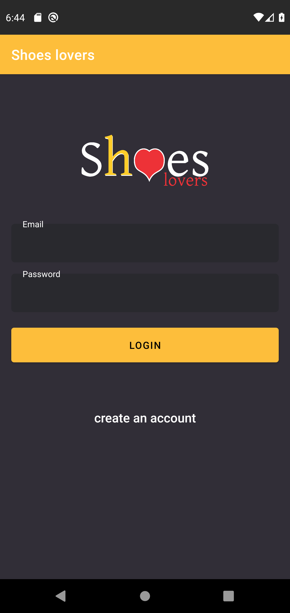
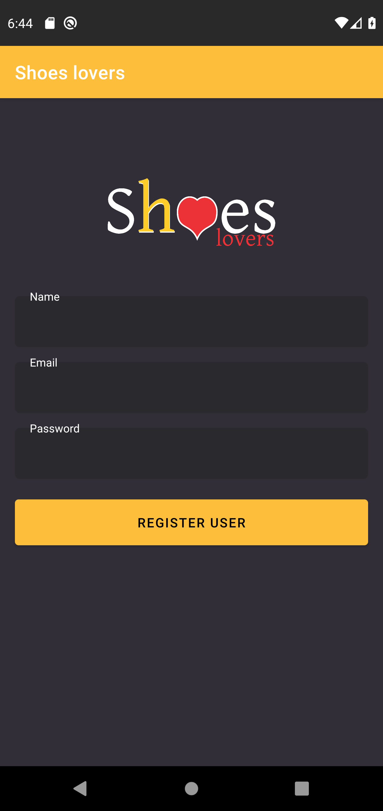
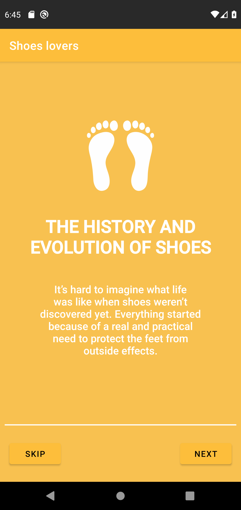
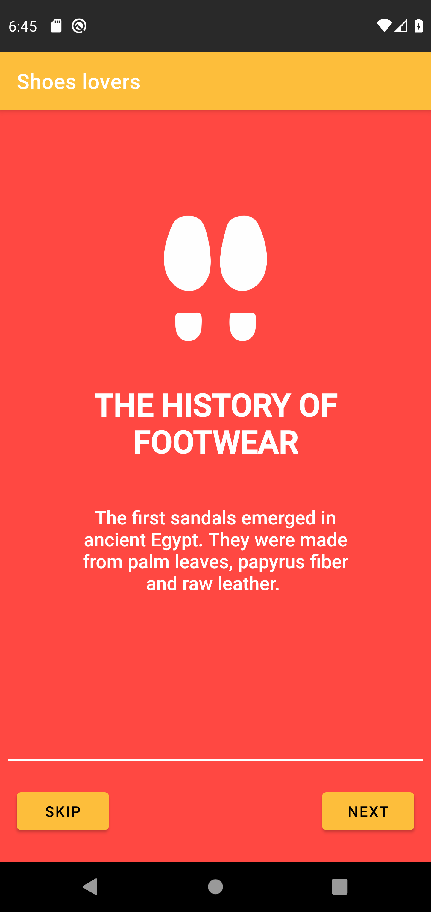
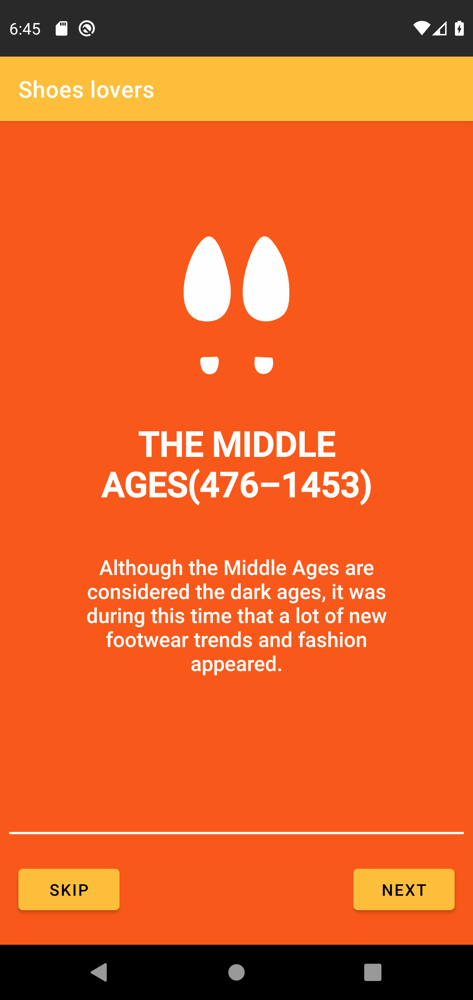
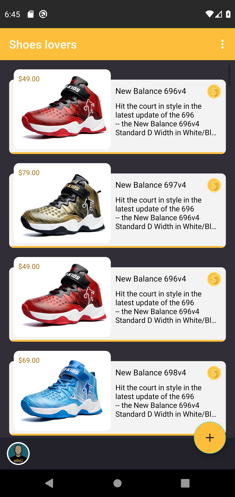
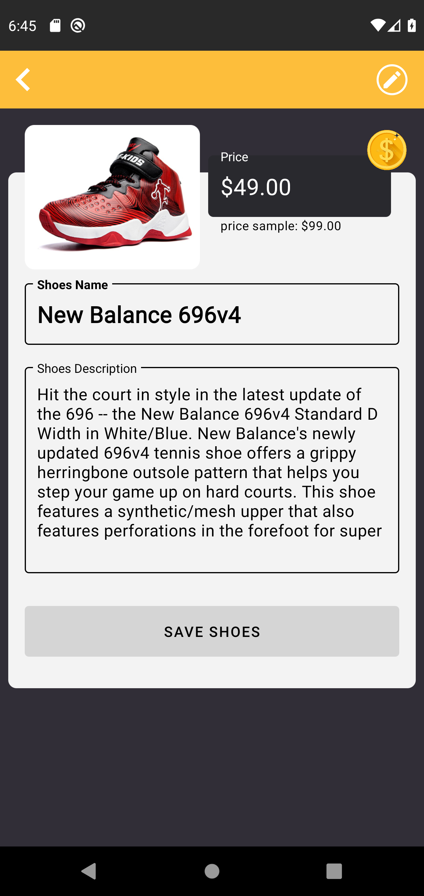
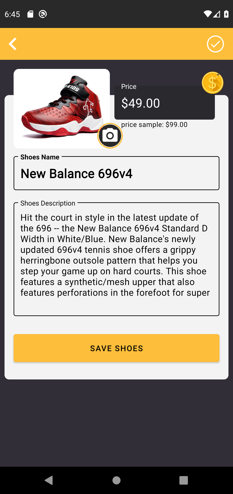
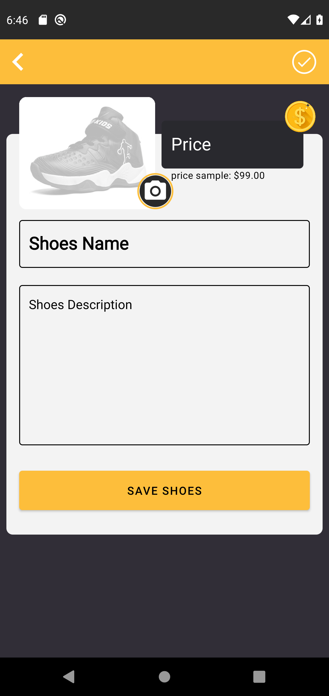
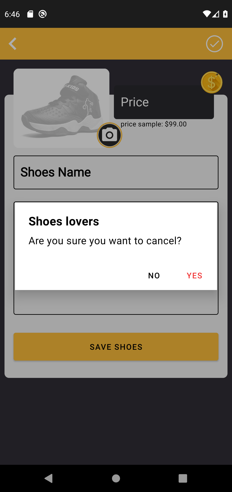

# TheShoeStore - Udacity Project

### **Overview - About this project**
This is an App made with kotlin as part of the **Android Kotlin Developer Nanodegree Program**

In this project, I applied my skills in building layouts and navigation files by building a Shoe Store app. <br />
This  app has **5 screens.**
<ul>
    <li>Login</li> 
    <li>Register</li> 
    <li>Onboarding</li> 
    <li>Shoe listing</li> 
    <li>Shoe detail page (edit/insert)</li>
</ul>

### 📷 How is this Project
</img>
</img>
</img>
</img>
</img>
</img>
</img>
</img>
</img>
</img>
</img>

### 💻Technology
- [Kotlin](https://kotlinlang.org/)

### Requirements
- AndroidX
- Min SDK 21+
- Compile SDK: 30+
- Java 8+

## Donation
If this project help you reduce time to develop, you can buy me a cup of coffee :) 

<a href="https://www.buymeacoffee.com/gilsonjuniorpro" target="_blank">
    
</a>

### License
```
Copyright 2020

Licensed under the Apache License, Version 2.0 (the "License");
you may not use this file except in compliance with the License.
You may obtain a copy of the License at

   https://www.apache.org/licenses/LICENSE-2.0

Unless required by applicable law or agreed to in writing, software
distributed under the License is distributed on an "AS IS" BASIS,
WITHOUT WARRANTIES OR CONDITIONS OF ANY KIND, either express or implied.
See the License for the specific language governing permissions and
limitations under the License.
```
